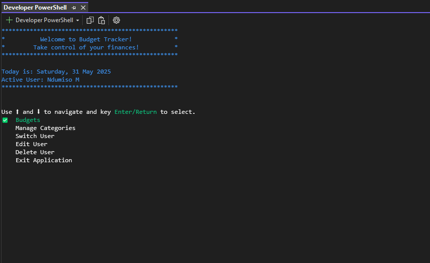
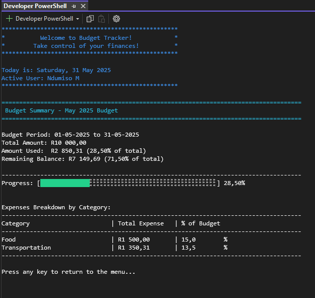
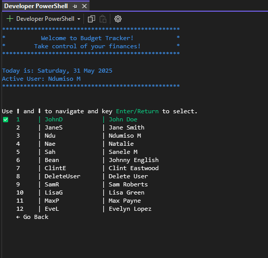
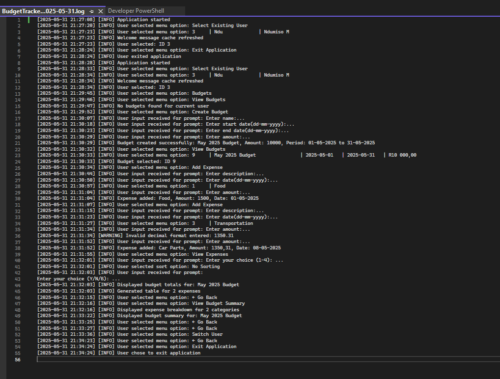

# Budget Tracker Console Application

An interactive .NET 8.0 console application for managing **personal and shared budgets**. Built with clean architecture principles and extensive unit testing.

## ✨ Features

- 👥 **Multi-User Support** – Create and manage independent user profiles
- 💼 **Budget Management** – Create monthly/period-based budgets
- 💸 **Expense Tracking** – Add, update, delete, and categorize expenses
- 🗂️ **Custom Categories** – Classify expenses with personalized tags
- 📊 **Real-Time Balance Insights** – Monitor total spent and remaining budget
- 🔍 **Smart Filters & Sorting** – View expenses by category, date, or amount
- 📈 **Visual Summary** – CLI-based budget progress bars and category breakdowns

---

## 🖼️ Screenshots

### 📌 Main Menu


### 📊 Budget Summary


### 👤 Multi-User Interface


### 📋 Sample Logs Output


---

## 🚀 Getting Started

### ✅ Prerequisites
- [.NET 8.0 SDK](https://dotnet.microsoft.com/en-us/download/dotnet/8.0) or later
- Visual Studio 2022 or Visual Studio Code

### 🧩 Installation & Running

1. Clone the repository
```bash
git clone https://github.com/Nduh0976/budget-tracker-console.git
```

2. Navigate to the project directory
```bash
cd budget-tracker-console
```

3. Build the solution
```bash
dotnet build
```

4. Run the application
```bash
cd BudgetTracker.Console
dotnet run
```

---

## 💡 How to Use

### 👤 Single User

1. Create a new user
2. Create a budget (set name, date range, and amount)
3. Add custom expense categories
4. Log expenses and view summaries

### 👥 Multiple Users

1. Add multiple users from the startup menu
2. Switch between users to access their unique data sets
3. Each user can manage separate:
   - Budgets
   - Categories
   - Expenses

---

## 🧱 Architecture

- **Clean Architecture**: Follows SOLID principles
- **Layered Design**: Separate projects for Console, Services, Data, and Models
- **Unit Testing**: Comprehensive test coverage using NUnit and Moq
- **CI/CD**: GitHub Actions workflow for automated testing

```
BudgetTracker.Console        ← Main Entry Point
BudgetTracker.Services       ← Business Logic & Interfaces (+ Menu Services, to move in future)
BudgetTracker.Models         ← Domain Entities
BudgetTracker.Data           ← Application & Persistence Logic
BudgetTracker.Tests          ← Unit Tests (NUnit + Moq)
```

### Key Patterns:

- Interface-driven development (`IUserService`, `IBudgetService`, etc.)
- Decoupled menu handling via `MenuService` and `MenuDisplayService`
- Clean console UI with colour formatting, smart navigation, and dynamic validation
- Centralized logging with user-friendly error handling (Every activity in the application is logged. Log files are git ignored, you can find the files under the `BudgetTracker.Data` library)

---

## 🧪 Running Tests

Unit tests cover all major service layers.

```bash
dotnet test
```

- Framework: `NUnit`
- Mocks: `Moq`
- Located in: `BudgetTracker.Tests`

---

## 📦 Built With

- [.NET 8.0](https://dotnet.microsoft.com/)
- C# 12
- [NUnit](https://nunit.org/)
- [Moq](https://github.com/moq)
- GitHub Actions (CI)

---

## 📩 Contact

**Ndumiso M.**  
[GitHub](https://github.com/Nduh0976) | [LinkedIn](https://www.linkedin.com/in/ndu-manqele)  
📧 *ndumisomanqele7@gmail.com*
